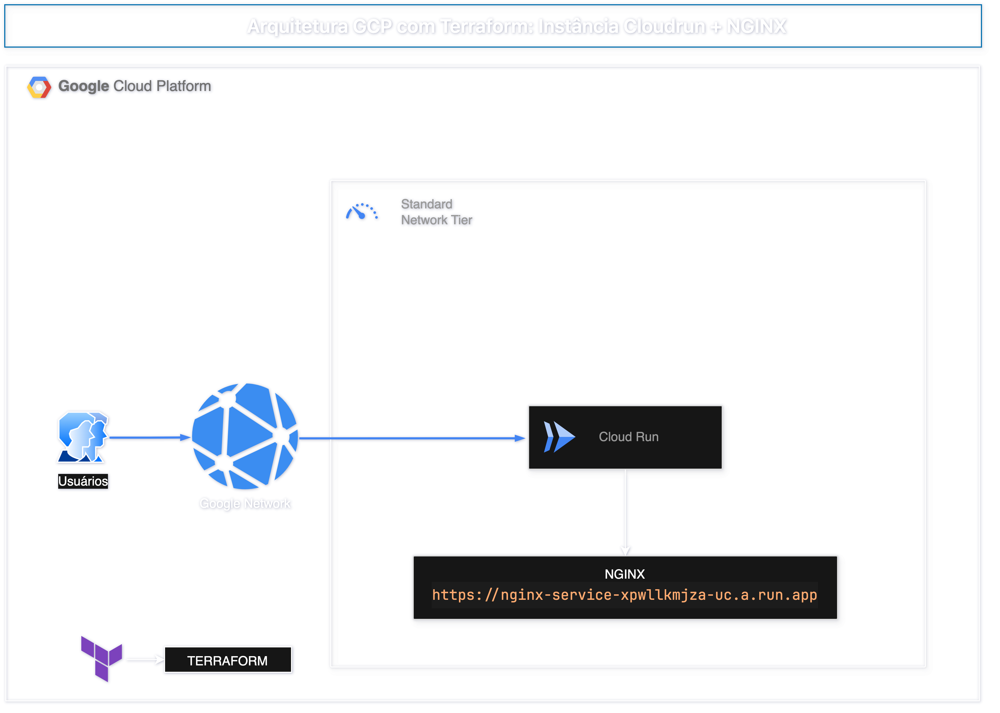

# Arquitetura GCP com Terraform: NGINX Container no Cloud Run

Este projeto provisiona uma infraestrutura serverless na Google Cloud Platform utilizando Terraform. O objetivo é demonstrar o deploy de um container NGINX utilizando **Cloud Run**, com acesso público e configurado diretamente com imagem do **Docker Hub** (`nginx:alpine`).

---

## 📌 Visão Geral da Arquitetura



---

## 🧱 Recursos Provisionados

| Recurso                        | Descrição                                                                 |
|--------------------------------|---------------------------------------------------------------------------|
| **Cloud Run**                  | Serviço serverless executando um container com NGINX.                     |
| **IAM (Cloud Run Invoker)**    | Permissão pública `roles/run.invoker` para permitir acesso HTTP externo. |

---

## 📂 Estrutura de Arquivos

```
.
├── main.tf                      # Código principal Terraform
├── variables.tf                 # Variáveis de entrada (ex: projeto, região)
├── outputs.tf                   # URL pública da aplicação no Cloud Run
├── gcp_nginx_cloudrun.drawio    # Diagrama da arquitetura editável
├── gcp_nginx_cloudrun.png       # Diagrama da arquitetura
└── README.md                   # Este arquivo
```

---

## ⚙️ Comandos Terraform

```bash
terraform init         # Inicializa o projeto
terraform plan         # Mostra as mudanças que serão aplicadas
terraform apply        # Aplica a infraestrutura na GCP
```

---

## 🌐 Acesso ao NGINX

Após o `apply`, o Terraform exibirá a **URL pública do Cloud Run**:

```
https://<random>.a.run.app
```

Acesse no navegador para visualizar a página padrão do NGINX servida a partir da imagem pública.

---

## 🧠 Requisitos

- Conta na [Google Cloud Platform](https://console.cloud.google.com/)
- Projeto com billing ativado
- Permissões para usar Cloud Run, IAM e imagens públicas do Docker Hub
- Terraform ≥ 1.0.0

---

## 🧪 Próximos passos (extensões possíveis)

- Substituir imagem por uma customizada hospedada no Artifact Registry
- Adicionar domínio customizado com HTTPS automático
- Criar CI/CD para push automático via Cloud Build
- Monitoramento com Stackdriver (Cloud Monitoring)

---

## 📘 Licença

MIT © [Alan Ramalho](https://github.com/raioramalho)