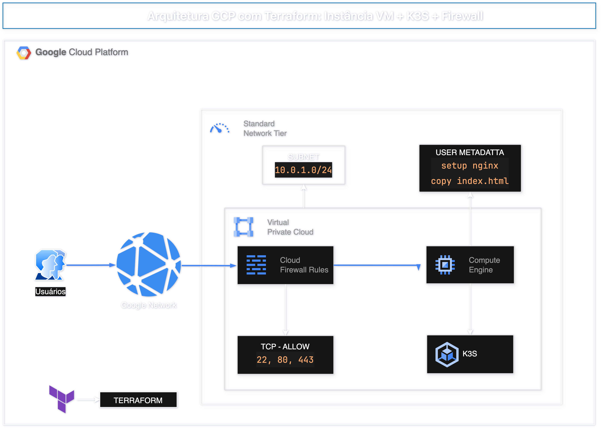

# Arquitetura GCP com Terraform: Instância VM + K3s + Firewall

Este projeto provisiona uma infraestrutura básica na Google Cloud Platform utilizando Terraform. O objetivo é demonstrar o provisionamento completo de uma **Compute Engine** com **K3s (Kubernetes leve) instalado via metadata**, conectada a uma **VPC customizada**, com regras de **firewall para SSH, HTTP, HTTPS, NodePort (30080) e API Kubernetes (6443)**.

---

## 📌 Visão Geral da Arquitetura



---

## 🧱 Recursos Provisionados

| Recurso              | Descrição                                                                 |
|----------------------|---------------------------------------------------------------------------|
| **VPC (Customizada)** | Rede virtual criada sem subnets automáticas.                             |
| **Sub-rede**         | CIDR `10.20.0.0/24` definida manualmente.                                 |
| **Firewall Rules**   | Permite acesso externo às portas **22**, **80**, **443**, **6443** e **30080**. |
| **Compute Engine**   | Instância `e2-micro` com **K3s** instalado via script de inicialização.   |
| **Startup Script**   | Script Bash que instala o K3s com Traefik e exporta kubeconfig.           |

---

## 📂 Estrutura de Arquivos

```
.
├── main.tf              # Código principal Terraform
├── k3s-server.sh        # Script de inicialização da VM com K3s
├── variables.tf         # Variáveis de entrada (ex: região, zona)
├── outputs.tf           # IP público e nome da instância
├── gcp_vm_k3s.drawio    # Diagrama da arquitetura editável
├── gcp_vm_k3s.png       # Diagrama da arquitetura
└── README.md            # Este arquivo
```

---

## ⚙️ Comandos Terraform

```bash
terraform init         # Inicializa o projeto
terraform plan         # Mostra as mudanças que serão aplicadas
terraform apply        # Aplica a infraestrutura na GCP
```

---

## 🧾 Script de Inicialização (k3s-server.sh)

```bash
#!/bin/bash
set -e

echo "[+] Atualizando sistema..."
apt-get update -y
apt-get install -y curl jq

# Captura o IP público da VM
PUBLIC_IP=$(curl -s http://metadata.google.internal/computeMetadata/v1/instance/network-interfaces/0/access-configs/0/external-ip \
  -H "Metadata-Flavor: Google")

echo "[+] IP público detectado: $PUBLIC_IP"

echo "[+] Instalando K3s com Traefik habilitado..."
curl -sfL https://get.k3s.io | \
  INSTALL_K3S_EXEC="--disable servicelb,metrics-server \
  --node-external-ip $PUBLIC_IP \
  --bind-address 0.0.0.0 \
  --tls-san $PUBLIC_IP" \
  sh -

echo "[+] Aguardando K3s subir..."
sleep 10

echo "[+] Configurando kubeconfig com IP público..."
mkdir -p /root/.kube
cp /etc/rancher/k3s/k3s.yaml /root/.kube/config
chmod 600 /root/.kube/config
sed -i "s/127.0.0.1/$PUBLIC_IP/" /root/.kube/config

echo "[+] Salvando token para workers..."
cat /var/lib/rancher/k3s/server/node-token > /root/node-token

echo "[✓] K3s control-plane pronto em https://$PUBLIC_IP:6443 com Traefik"
```

---

## 🔐 Acesso à VM e Cluster

Após o `apply`, o Terraform exibirá o **IP público da instância**.

Para acessar o cluster:

```bash
ssh -i sua-chave.pem usuario@<ip-publico>
sudo cat /root/.kube/config > k3s-config.yaml
export KUBECONFIG=./k3s-config.yaml
kubectl get nodes
```

---

## 🧠 Requisitos

- Conta na [Google Cloud Platform](https://console.cloud.google.com/)
- Projeto com billing ativado
- Permissões para criar VPC, sub-rede, firewall e instâncias
- Terraform ≥ 1.0.0

---

## 🧪 Próximos passos (extensões possíveis)

- Adicionar node workers remotos
- Ingress com TLS via Traefik + Let's Encrypt
- Observabilidade com Prometheus + Grafana
- Descrição via `terraform output` com comandos prontos

---

## 📘 Licença

MIT © [Alan Ramalho](https://github.com/raioramalho)