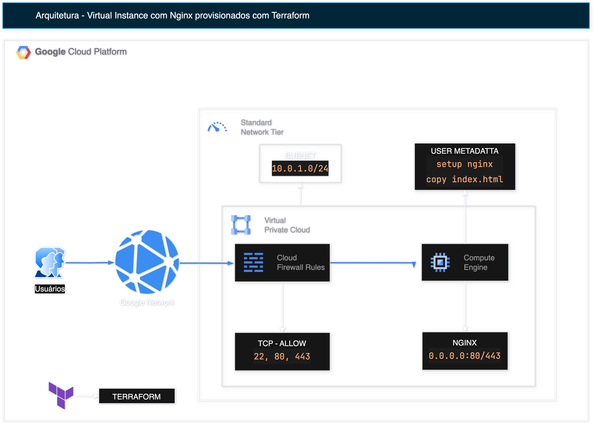

# Arquitetura GCP com Terraform: Instância VM + NGINX + Firewall

Este projeto provisiona uma infraestrutura básica na Google Cloud Platform utilizando Terraform. O objetivo é demonstrar o provisionamento completo de uma **Compute Engine** com **NGINX configurado via metadata**, conectada a uma **VPC customizada**, com regras de **firewall para SSH, HTTP e HTTPS**.

---

## 📌 Visão Geral da Arquitetura



---

## 🧱 Recursos Provisionados

| Recurso              | Descrição                                                                 |
|----------------------|---------------------------------------------------------------------------|
| **VPC (Customizada)** | Rede virtual criada sem subnets automáticas.                             |
| **Sub-rede**         | CIDR `10.0.1.0/24` definida manualmente.                                  |
| **Firewall Rules**   | Permite acesso externo nas portas **22**, **80** e **443**.               |
| **Compute Engine**   | Instância `e2-micro` com **NGINX** pré-instalado via metadata script.     |
| **Startup Script**   | Script Bash que instala o NGINX e copia um `index.html` para `/var/www`. |

---

## 📂 Estrutura de Arquivos

```
.
├── main.tf              # Código principal Terraform
├── files/
│   └── index.html       # Página de exemplo para o NGINX
├── variables.tf         # Variáveis de entrada (ex: região, zona)
├── outputs.tf           # IP público e nome da instância
├── gcp_vm_ngninx.drawio # Diagrama da arquitetura editavel
├── gcp_vm_ngninx.png    # Diagrama da arquitetura
└── README.md            # Este arquivo
```

---

## ⚙️ Comandos Terraform

```bash
terraform init         # Inicializa o projeto
terraform plan         # Mostra as mudanças que serão aplicadas
terraform apply        # Aplica a infraestrutura na GCP
```

---

## 🧾 Metadata de Inicialização (Startup Script)

```bash
<<-EOF
    #!/bin/bash
    apt-get update
    apt-get install -y nginx
    systemctl enable nginx
    systemctl start nginx

    # Cria o index.html a partir de conteúdo embutido
    cat <<EOT > /var/www/html/index.html
${replace(file("${path.module}/files/index.html"), "$", "\\$")}
EOT

    systemctl enable nginx
    systemctl restart nginx
  EOF
```

---

## 🔐 Acesso à VM

Após o `apply`, o Terraform exibirá o **IP público da instância**:

E acesse a página NGINX via:

```
http://<ip-publico>
https://<ip-publico>
```

---

## 🧠 Requisitos

- Conta na [Google Cloud Platform](https://console.cloud.google.com/)
- Projeto com billing ativado
- Permissões para criar VPC, sub-rede, firewall e instâncias
- Terraform ≥ 1.0.0

---

## 🧪 Próximos passos (extensões possíveis)

- Configuração de domínio com Cloud DNS
- HTTPS com Let's Encrypt
- Logging com Cloud Logging
- Template para múltiplas instâncias

---

## 📘 Licença

MIT © [Alan Ramalho](https://github.com/raioramalho)